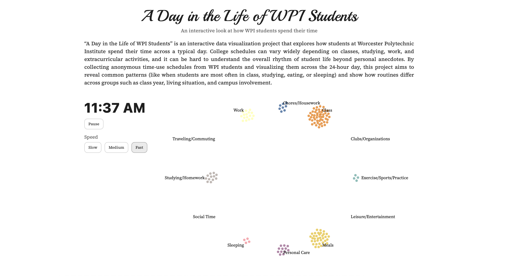

# A Day in the Life of WPI Students

**Project Website:** *[Project Website Link](https://diwakarsandhu1.github.io/final/)*  
**Screencast:** *[Sreencast Link](https://www.youtube.com/watch?v=K96AQe1bTzg)*  

## Overview
“A Day in the Life of WPI Students” is an interactive data visualization that explores how WPI students spend their time across a typical day. Each dot represents a survey respondent, and dots move between activity categories as time advances, showing how student routines shift throughout the day.

This project is inspired by [FlowingData’s “A Day in the Life of Americans,”](https://flowingdata.com/2015/12/15/a-day-in-the-life-of-americans/) adapted to a WPI-specific dataset collected via a survey.

## Key Question
**How do WPI students spend their time throughout an average day, and what patterns emerge over the 24-hour cycle?**

## Repository Contents
- **`index.html`** – Main webpage (layout, styling, and D3 visualization).
- **`data/clean_data.csv`** – Cleaned survey dataset used by the visualization.
- **`ProcessBook.pdf`** – Project process book describing the project’s motivation, design evolution, and evaluation.

## Data
Data was collected through a Google Form where students reported their **primary activity for each hour of a day**. The form also included demographic questions such as:
- Class year
- Major(s)
- Living situation
- Campus involvements (e.g., Greek life, varsity athletics, clubs)

**Sample size:** 36 responses  
**Important limitation:** The sample is skewed toward upperclassmen and students involved in Greek life and varsity athletics, so the visualization is best interpreted as an exploratory snapshot rather than a representative description of all WPI students.

## How the Visualization Works
- Each dot = one survey response (a student)
- Activity categories are arranged around a circular layout
- The displayed time advances through the day (minute-by-minute display derived from hourly data)
- As time changes, dots “flow” to the activity category that respondent reported for that hour
- Controls allow the viewer to play/pause and adjust playback speed (Slow/Medium/Fast)

## Techinal Achievements
- Animated, time-based d3 simulation
- Smooth playback controls with speed
- Cleaned and normalized raw survery categories

## Design Achievements
- Arranged activites in a circle
- Consistent color encoding for activites
- Clean 2-panel layout for visualization